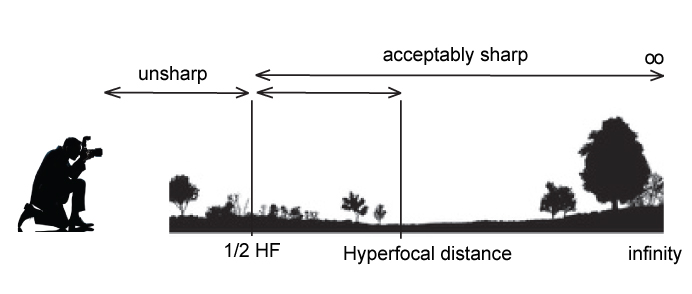
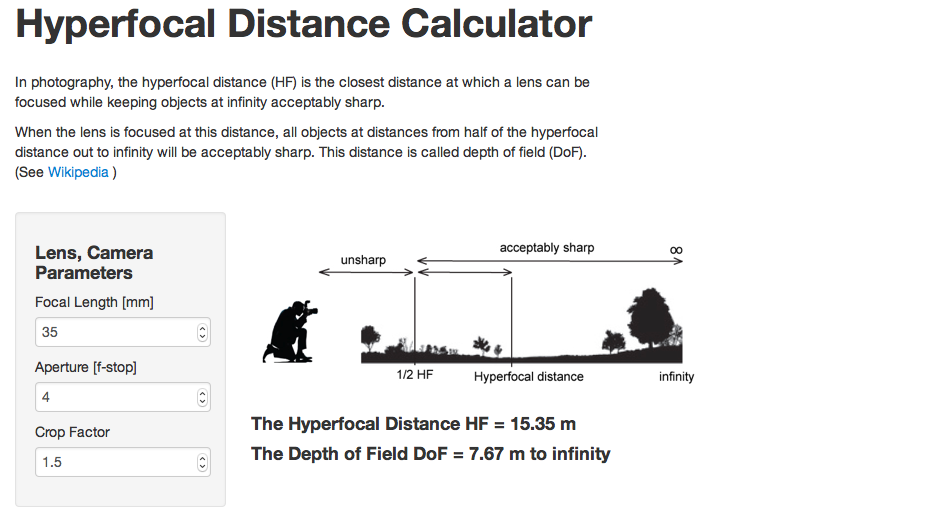

Hyperfocal Distance
========================================================
author: Peter Putz
date: September 23, 2015

**A web-based calculator for photographers**

Photography and Hyperfocal Distance
========================================================



<small>In photography, the **hyperfocal distance (HF)** is the closest 
distance at which a lens can be focused while keeping objects 
at infinity acceptably sharp.</small>

<small>When the lens is focused at the HF, all objects at 
distances from half of the hyperfocal distance out to 
infinity will be acceptably sharp. This distance is called 
**depth of field (DoF)**.</small>


Challenge for a Photographer
========================================================

The HF is dependent on camera, lens and exposure parameters.
This is **hard to calculate** on the fly.

$$HF = \frac{f^2}{ac / CF} + f$$

where

$$
\begin{aligned}
  HF & : \text{hyperfocal distance in mm} \\
  f & : \text{focus length of lens in mm} \\
  a & : \text{aperture in f-stops} \\
  c & : \text{circle of confusion in mm} \\
  CF & : \text{crop factor for film or image sensor size}
\end{aligned}
$$

Implementation in R
========================================================


```r
hyperfocDist <- function(f, a, cf) {
  HF <- round(
    ((f^2/(a*0.03/cf) + f)/1000),
    2)}

hf <- hyperfocDist(35, 4, 1.5)

print(hf)
```

```
[1] 15.35
```


Screenshot Shiny App
========================================================



<small>[Source code on github](https://github.com/pputz/hf_distance)</small>
